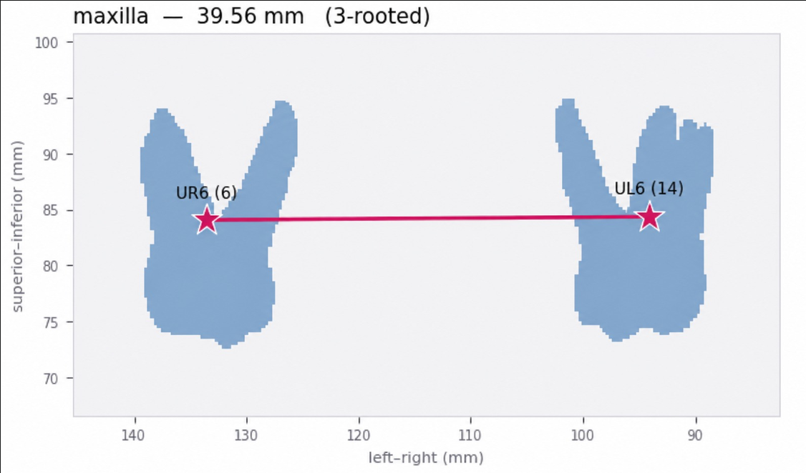
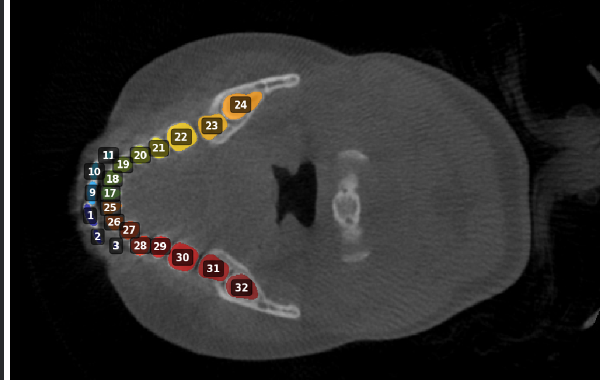
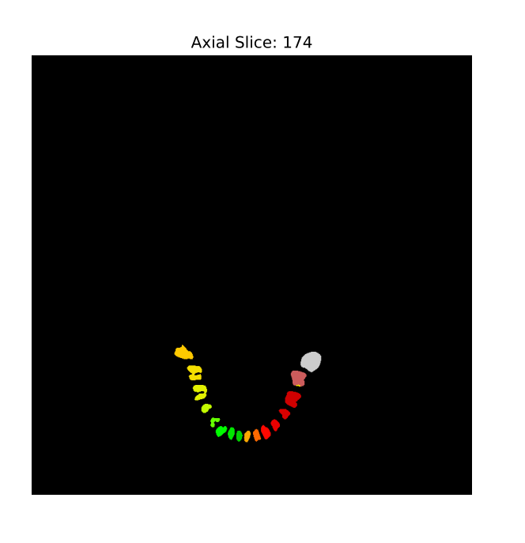
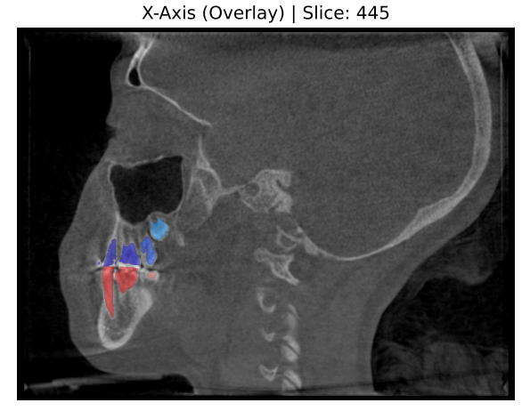
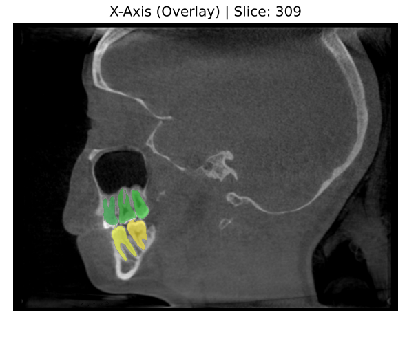
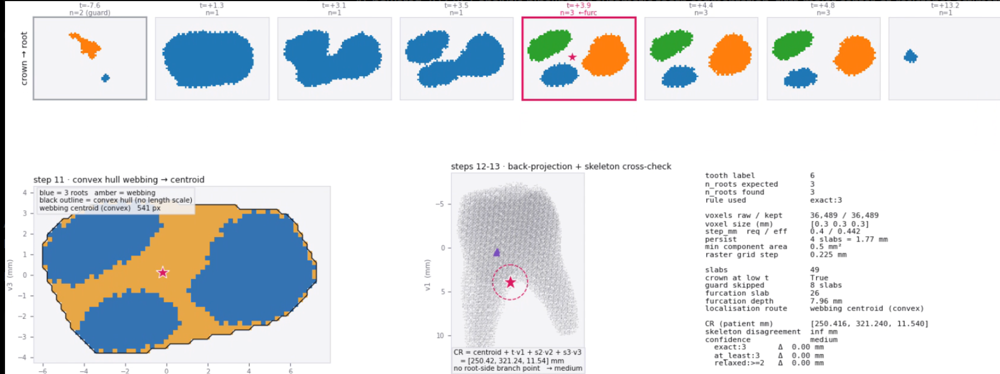
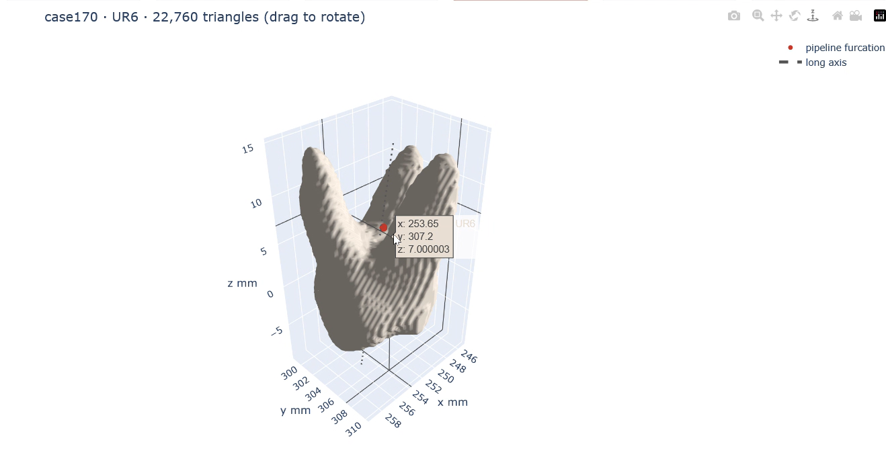
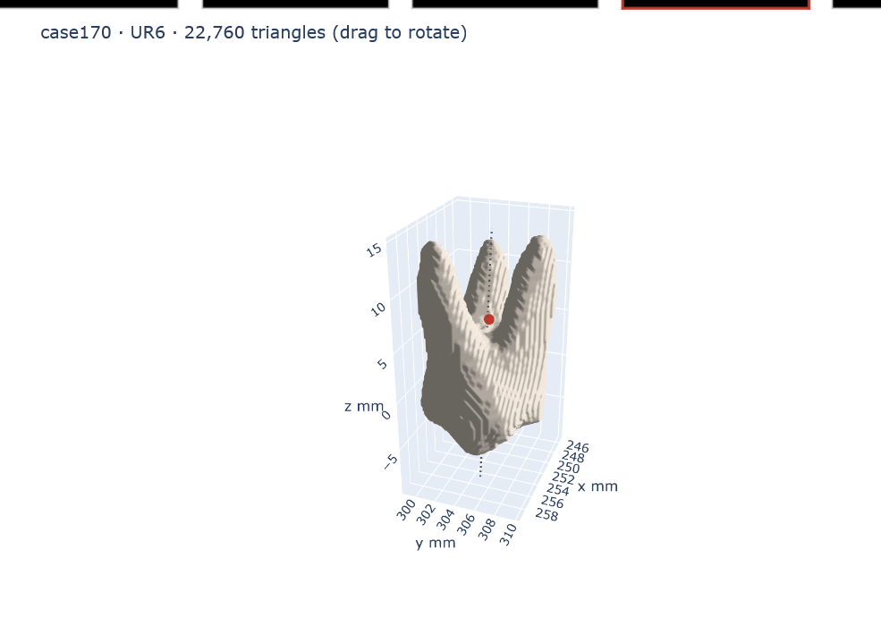
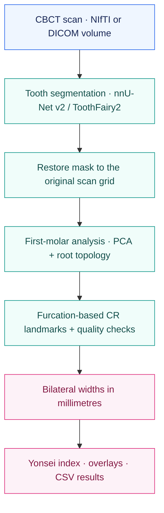

<a id="top"></a>

<h1 align="center">🦷 CBCT Transverse<br>Basal-Bone Width Analysis</h1>

<p align="center">
  <b>From 3D tooth segmentation to explainable transverse measurements.</b><br>
  nnU-Net segmentation · PCA-guided furcation localization · Bilateral width analysis
</p>

<p align="center">
  <a href="https://www.python.org/"></a>
  <a href="https://pytorch.org/"></a>
  <a href="https://github.com/MIC-DKFZ/nnUNet"></a>
  <a href="https://zenodo.org/records/14893540"></a>
  <a href="https://streamlit.io/"></a>
</p>

<p align="center">
  <a href="#pipeline-in-action">Image gallery</a> ·
  <a href="#how-it-works">How it works</a> ·
  <a href="#running-the-project">Getting started</a> ·
  <a href="#validation-philosophy">Validation</a> ·
  <a href="#code-walkthrough">Technical details</a>
</p>

<p align="center">
  <a href="./fig6-transverse-width-cr.png">
    
  </a>
  <br>
  <sub><b>Figure 6 · A measurement you can inspect.</b> Example maxillary width: <b>39.56 mm</b>. Pink stars mark the estimated furcation-based CR points.</sub>
</p>

> **Research prototype.** Measurements and classifications support research review; this is not a certified medical device. See [validation scope](#validation-philosophy) and [limitations](#limitations).

## Overview

This project connects automatic **3D CBCT tooth segmentation** with geometric analysis of the four first molars. It estimates furcation-based center-of-resistance (CR) landmarks, measures bilateral widths in millimetres, and reports the **Yonsei Transverse Index** with per-tooth quality checks.

The workflow supports a **Streamlit interface** and **direct notebook batch processing**. Ground-truth landmarks are optional: they are used for validation, not required for inference.

| Segment | Measure | Review |
| :--- | :--- | :--- |
| ToothFairy2 + nnU-Net v2 generate a multi-label tooth mask. | PCA-guided furcation analysis locates bilateral first-molar landmarks in physical space. | Image overlays, confidence flags, and CSV exports make each result inspectable. |

## Pipeline in Action

Explore the segmentation figures, measurement results, and application screenshots. **Click any figure to open it at full resolution.**

### 01 · Tooth segmentation

<table>
  <tr>
    <td align="center" width="50%">
      <a href="./fig1-segmentation-fdi-labels.png"></a><br>
      <sub><b>Figure 1 · Segmentation on the scan</b><br>Color-coded tooth masks overlaid on the CBCT.</sub>
    </td>
    <td align="center" width="50%">
      <a href="./fig2-segmentation-arch-isolated.png"></a><br>
      <sub><b>Figure 2 · Isolated arch</b><br>Individual tooth labels ready for geometric analysis.</sub>
    </td>
  </tr>
</table>

The displayed numeric IDs are the model's dense segmentation labels, not FDI tooth numbers.

### 02 · Check the overlay

<table>
  <tr>
    <td align="center" width="50%">
      <a href="./fig3-sagittal-overlay-445.png"></a><br>
      <sub><b>Figure 3 · Sagittal slice 445</b><br>Visual inspection of the segmentation.</sub>
    </td>
    <td align="center" width="50%">
      <a href="./fig4-sagittal-overlay-309.png"></a><br>
      <sub><b>Figure 4 · Sagittal slice 309</b><br>A second view of mask alignment.</sub>
    </td>
  </tr>
</table>

### 03 · Inspect the furcation estimate

<p align="center">
  <a href="./fig5-furcation-diagnostics.png"></a>
</p>

**Figure 5 · From root separation to a 3D landmark.** The highlighted cross-section contains three separated roots. The webbing centroid supplies the furcation estimate, which is back-projected into patient coordinates and checked against the tooth skeleton.

| Diagnostic | Shown in this example |
| :--- | :--- |
| Root-count rule | `exact:3` — three expected roots found |
| Furcation depth | `7.96 mm` |
| Confidence | `medium` — no root-side skeleton branch available for comparison |
| Measurement | [Figure 6](./fig6-transverse-width-cr.png) shows the bilateral maxillary width: **39.56 mm** |

Figure 6 retains its original left/right label annotations. For the documented corrected mapping, see [Reference Tables](#reference-tables); exchanging bilateral side names does not change their distance.

### 04 · Inspect the molar in 3D

<table>
  <tr>
    <td align="center" width="50%">
      <a href="./fig7-3d-molar-furcation.png"></a><br>
      <sub><b>Figure 7 · Furcation coordinates</b><br>3D molar view with the landmark tooltip.</sub>
    </td>
    <td align="center" width="50%">
      <a href="./fig9-3d-molar-alternate-view.png"></a><br>
      <sub><b>Figure 9 · Alternate viewing angle</b><br>A second perspective on the roots and furcation point.</sub>
    </td>
  </tr>
</table>

**Figures 7 & 9 · 3D molar and furcation landmark.** Two views of the UR6 surface mesh show the pipeline's furcation point in red and the dashed long axis. Figure 7 includes a coordinate tooltip; Figure 9 shows the tooth from another angle. These are static captures of the rotatable 3D view; click either image to open it at full resolution.

## How It Works



Every geometric calculation uses **physical patient coordinates**, transformed through the scan's NIfTI affine. PCA supplies a local tooth frame; cross-sectional root topology supplies the furcation estimate.

```text
Maxillary width  = ‖ CR(UR6) − CR(UL6) ‖₂
Mandibular width = ‖ CR(LR6) − CR(LL6) ‖₂
Yonsei index    = Maxillary width − Mandibular width
```

## Key Features

| Capability | What it provides |
| :--- | :--- |
| **Automatic tooth segmentation** | Dense multi-label masks restored to the original CBCT grid. |
| **Anatomically guided localization** | Expected root counts, a crown guard, and persistence checks along the tooth axis. |
| **Explainable quality control** | Root-count rules, skeleton agreement, confidence, and furcation depth for each molar. |
| **Optional landmark validation** | Image CS / Patient CS CSV support with coordinate mapping and tooth-landing checks. |
| **Batch processing** | Per-case CSV checkpoints, resume support, and automatic landmark-file discovery. |
| **Existing-mask reuse** | The fast notebook can validate and reuse saved masks, avoiding repeated segmentation when suitable masks are available. |
| **Cohort evaluation** | CCC, ICC(2,1), and Bland–Altman summaries when enough validated cases are available. |

---

<details>
<summary><b>Explore segmentation, geometry, classification, and validation methods</b></summary>

### 🔬 1. Automatic 3D Tooth Segmentation

The pipeline uses the publicly released **ToothFairy2 tooth-segmentation model** (`Dataset121_ToothFairy2_Teeth`), run through **nnU-Net v2** with fold `5`.

It accepts:

- NIfTI volumes (`.nii`, `.nii.gz`)
- DICOM folders and DICOM ZIP archives
- Complete multi-file DICOM series or single-file multi-frame 3D DICOM volumes
- Automatic DICOM → NIfTI conversion (SimpleITK)
- DICOM scan folders nested inside Invivo `.inv` package directories (batch mode)

nnU-Net predicts on its own internal resampled grid; the app then **restores the segmentation to the original uploaded CBCT's shape and affine** using nearest-neighbour resampling, so every downstream measurement — and the file you can download — lives on the same grid as the scan you uploaded.

See [Figures 1 and 2](#pipeline-in-action) for the multi-label segmentation.

**Verifying the segmentation before trusting a measurement.** The app also overlays predicted labels directly on the grayscale CBCT so a mis-segmentation is visible immediately, rather than silently propagating into a wrong width:

See [Figures 3 and 4](#pipeline-in-action) for sagittal overlay checks.

### 🧭 PCA-Based 3D Tooth Orientation

A key geometric step is estimating a stable coordinate frame for each segmented first molar. PCA is **never run on raw voxel indices** — every foreground voxel is first converted to physical patient-space millimetres via the NIfTI affine, *then* PCA is applied to that point cloud:

```python
patient_xyz = nib.affines.apply_affine(affine, voxel_ijk)   # (i, j, k) -> (x, y, z) mm
mean, axes  = _principal_axes(patient_xyz)                  # axes[0] = v1 = long axis
```

#### Why this matters

CBCT volumes can have anisotropic voxel spacing and non-trivial orientation baked into the affine. Running PCA directly on `(i, j, k)` indices biases the recovered direction toward whichever axis happens to be more finely sampled. Applying the affine first, then computing the 3×3 covariance matrix and its eigenvectors in millimetre space, removes that bias entirely — this is one of the module's stated non-negotiable correctness requirements.

```text
Segmented tooth voxels → (i,j,k) → [NIfTI affine] → (x,y,z) mm
        → centre at centroid → 3×3 covariance → eigen-decomposition
        → v1 (long axis), v2, v3 (orthogonal cross-section axes)
```

The eigenvector *sign* is fixed by a deterministic rule (largest-magnitude component forced non-negative, right-handedness enforced by the cross product) so re-running the pipeline on the same scan always reproduces the same frame — a detail that matters for a scientific pipeline whose numbers may be audited.

PCA gives a **geometric** coordinate system, not the final anatomical answer: crown-vs-root polarity along `v1` is resolved separately, from mask topology (see below), because the direction of maximum variance alone isn't reliably the crown→root axis for a tooth whose crown is wide and whose roots splay.

### 🔎 PCA-Guided Furcation Search

Once a tooth has a coordinate frame, `_find_furcation_3d` sweeps along `v1` in `step_mm`-sized slabs (0.4 mm, adaptively widened so it's never finer than the voxel size projected onto `v1`). At each slab, foreground voxels are projected onto `(v2, v3)`, rasterised on a sub-voxel grid, and connected-component-labelled to count how many separate roots are visible at that level.

**Figure 5 — Furcation-localization diagnostics for a maxillary first molar (label 6).** This is the pipeline's internal reasoning made visible, panel by panel:

| Panel | What it shows |
|---|---|
| **Top strip** | The crown→root cross-sectional sweep. Each tile is one slab along `v1`; `n` is the component count found by `_cross_section_component_count`. The sweep runs `n=1` (single crown blob) → `n=2` (two roots visible, one still fused with the third) → **`n=3`, highlighted in pink** — the slab where all three maxillary roots (mesiobuccal, distobuccal, palatal) are simultaneously separated. |
| **"step 11 — convex hull webbing → centroid"** | At the chosen slab, blue = the 3 separated root components; amber = the *webbing* — the convex hull of the cross-section minus the components themselves. The star marks the webbing centroid: the furcation point in the `(v2, v3)` plane. |
| **"steps 12–13 — back-projection + skeleton cross-check"** | The 2D point is back-projected into 3D patient coordinates (`CR = centroid + t·v1 + s2·v2 + s3·v3`) and compared against the nearest root-side branch point of an independent 3D morphological skeleton (purple triangle). |
| **Metadata panel** | The exact numbers behind the estimate: `n_roots_expected=3`, `n_roots_found=3`, `rule_used=exact:3`, voxel size `[0.3, 0.3, 0.3]` mm, `furcation_depth_mm=7.96` (anatomically plausible — a first molar's furcation should sit roughly 6–11 mm apical to the crown's height of contour), and `confidence=medium` (no root-side skeleton branch was available for cross-check on this tooth — not itself a red flag, just a silent independent check). |

This view exists specifically for **explainability and debugging**: instead of trusting a single output coordinate, you can see *why* a particular slab was chosen as the furcation and *how* the point inside it was computed.

### 🧮 PCA in the Overall Measurement Pipeline

1. Extract the binary tooth mask from the nnU-Net segmentation (`data == label`).
2. Convert foreground voxels from voxel indices to physical millimetre coordinates.
3. Compute the centroid and three orthogonal principal directions (PCA).
4. Resolve the anatomical crown-to-root orientation (cross-sectional area peak, not PCA sign).
5. Sweep along the long axis in 0.4 mm slabs.
6. Detect the first slab where *exactly* the tooth's expected root count persists for 4 consecutive slabs (1.6 mm).
7. Localise the furcation point as the convex-hull webbing centroid of that slab.
8. Cross-check against an independent 3D skeleton branch point.
9. Take the Euclidean distance between the two bilateral first-molar CRs as the arch's transverse width.

### 🦷 2. First-Molar Center-of-Resistance Estimation

For each first molar, the system estimates a furcation-based center of resistance (CR) — the point conventionally used in the **Yonsei transverse analysis** (Koo et al., *Korean J Orthod* 2017) — entirely in physical millimetre coordinates, so anisotropic voxel spacing never distorts the result.

The algorithm chain:

- 3D mask cleaning (hole filling + largest-component keep)
- Physical-coordinate transform
- PCA-based long-axis estimation
- Cross-sectional rasterisation at sub-voxel resolution
- Connected-component analysis with a persistence requirement
- Convex-hull webbing localisation
- 3D skeletonisation as an independent cross-check

### 🧠 3. Anatomically Aware Root Detection

| Arch | First molar | Expected roots |
|---|---|---:|
| Maxilla | First permanent molar | **3** (mesiobuccal, distobuccal, palatal) |
| Mandible | First permanent molar | **2** (mesial, distal) |

The furcation search uses a strictness **ladder**, tried in order, and the rung that fired is reported per tooth (`rule_used`):

1. **`exact:N`** — exactly the expected root count persisted. The intended case; the CR sits at the true N-way furcation.
2. **`at_least:N`** — ≥N components persisted (a spurious extra fragment was tolerated).
3. **`relaxed:>=2`** — only for 3-rooted (maxillary) teeth: the roots never resolved into 3 separate components in the segmentation, so the algorithm falls back to a 2-component rule. This carries a known **outward/buccal bias** and is explicitly flagged rather than silently trusted.

A **crown guard** starts the crown→root walk at the tooth's height of contour (its single largest cross-section), which cannot exclude a true furcation — but reliably excludes the occlusal cusps, which would otherwise rasterise as 4–5 disconnected components and get misread as a "furcation" ~10 mm too coronal.

### 📐 4. Transverse Width Measurement

```text
Maxillary width  = ‖ CR(UR6) − CR(UL6) ‖₂
Mandibular width = ‖ CR(LR6) − CR(LL6) ‖₂
```

See [Figure 6](./fig6-transverse-width-cr.png) for the example maxillary width of **39.56 mm**.

All measurements are reported in **millimetres**.

### 📊 5. Yonsei Transverse Index

```text
Yonsei Transverse Index = Maxillary width − Mandibular width
```

| Index value | Classification |
|---|---|
| `< −2.26 mm` | Skeletal crossbite (maxillary transverse deficiency) |
| `−2.26 mm … +1.48 mm` | Normal transverse skeletal relationship |
| `> +1.48 mm` | Skeletal transverse excess pattern |

The two cut-offs are the reference cohort's mean ± 1 SD (mean `−0.39 mm`, SD `1.87 mm`) and are **editable in the Streamlit sidebar** — they should be interpreted against whichever clinical/reference protocol a given study uses.

A second, independent sub-classification is applied per arch using absolute normal ranges (also sidebar-editable):

| Arch | Deficiency | Normal | Excess |
|---|---|---|---|
| Maxilla | `< 45.64 mm` | `45.64 – 51.08 mm` | `> 51.08 mm` |
| Mandible | `< 46.30 mm` | `46.30 – 51.20 mm` | `> 51.20 mm` |

This matters because the *index* only tells you whether the two arches match each other — a narrow maxilla sitting over an equally narrow mandible gives a "normal" index while both arches are individually deficient. The absolute sub-classification catches that case.

### 🧪 6. Ground-Truth Validation

The interface accepts **both** OEM landmark exports for a scan — the **Image CS** file and the **Patient CS** file — and validates predictions against them without fitting any free parameters when the grids correspond:

- Parses both landmark CSVs independently
- Matches landmarks to first-molar labels by FDI tooth code (16/26/46/36), so it's agnostic to which label numbers are configured
- **Zero-parameter mapping (primary path):** since the OEM landmarks are digitised on the same physical grid as the scan, an Image-CS value maps to a voxel index by pure division by voxel spacing, then through the scan's own affine — no fitting involved
- **Landing check:** every mapped GT point must land within 8 voxels (~2.4 mm) of its own tooth's label in the segmentation before its error is trusted; a point landing on the *wrong* tooth (e.g. a mirrored contralateral assignment, ~40 mm away) is caught here rather than silently averaged in
- **Frame-recovery fallback:** only engaged when zero-parameter mapping can't be used (grid mismatch, re-oriented import) — recovers a rigid transform from the first-molar landmarks themselves
- Automatically re-verifies left/right label handedness per case and switches if a scan was converted by a chain with the opposite handedness
- Reports mean / max / RMS Euclidean landmark error

This explicitly separates **coordinate-frame problems** from genuine localization disagreement — a common failure mode in 3D medical-image evaluation is mistaking a frame mismatch for model error.

### 📈 7. Cohort-Level Evaluation

Once **3 or more** validated cases have accumulated, `batch_cohort_stats.csv` reports, per arch and for the transverse index:

- **Lin's Concordance Correlation Coefficient (CCC)**
- **ICC(2,1)** — two-way random-effects, absolute agreement, single measurement (Shrout & Fleiss)
- **Bland–Altman bias and limits of agreement**
- Per-case landmark-error summaries

### 📁 8. Batch Processing

A folder of scans — NIfTI, DICOM ZIPs, DICOM folders, or **DICOM folders nested inside Invivo `.inv` packages** (the largest candidate scan volume is attempted first) — is processed end-to-end, writing:

```text
batch_results.csv        # one row per case: widths, index, diagnosis, per-tooth QC flags
batch_landmarks.csv      # one row per case × molar: predicted CR, mapped GT CR, error, landing distance
batch_cohort_stats.csv   # CCC / ICC(2,1) / Bland–Altman once ≥3 GT-carrying cases exist
```

The batch engine is **crash-safe by design**:

- CSVs are rewritten after **every** case, not at the end
- Re-running the same output folder skips cases already marked `status == "ok"`
- Failed cases are simply retried on the next run
- Landmark CSVs sitting next to (or in the parent of) a case are attached automatically, matched by case ID when a folder holds several cases

</details>

---

## Running the Project

**Repository contents:** this public repository currently contains the README files and nine figures/screenshots. The notebook, generated `app.py`, and model weights are not included in this checkout.

### Google Colab · direct batch processing

With `CBCT_Width_Fast_Reuse_Existing_MasksFINAL.ipynb` available locally:

1. Upload the notebook to [Google Colab](https://colab.research.google.com/) and open it.
2. Run the dependency cell. If it requests a runtime restart, restart before continuing.
3. Mount Google Drive, then run the cell that writes `app.py`.
4. For cases needing fresh segmentation, configure the selected device and download the ToothFairy2 weights. A GPU runtime is the intended route for new inference.
5. Set `BATCH_ROOT` to the folder containing the actual scan volumes and choose the batch output paths.
6. Run the configuration cell, followed by the final direct-batch cell. No public app URL is needed.

```python
REUSE_EXISTING_MASKS = True
FORCE_RERUN = False
SAVE_SEG = True
```

Existing masks are checked against the prepared scan's shape, affine, and tooth-label values before reuse. If every needed mask is available, the measurement batch does not require model weights or CUDA. Keep case IDs unique and reuse only masks from the corresponding scans with the same label mapping; geometry checks alone do not establish patient or model identity.

Completed cases can resume from existing result CSVs. After a runtime reset, set `RESUME_CSV_DIR` to the previous batch's Drive output folder if you want to restore those results. Existing-mask reuse itself does not require a previous results CSV.

### Local Streamlit interface

After generating `app.py` from the notebook and preparing its dependencies and model environment:

```bash
streamlit run app.py
```

### Supported inputs and outputs

| Input | Notes |
| :--- | :--- |
| `.nii` / `.nii.gz` | Complete 3D NIfTI scans. |
| DICOM folders / ZIPs | Complete slice series, including nested scan folders. |
| Single `.dcm` | Must contain a complete multi-frame 3D scan; a single 2D slice is insufficient. |
| Invivo exports | Use exported DICOM data, including DICOM folders inside `.inv` package directories. A standalone `.inv` project file is not a scan volume. |
| Landmark CSVs | Optional `ImageCS` / `PatientCS` exports for validation. |

| Output | Contents |
| :--- | :--- |
| `batch_results.csv` | Per-case widths, index, classifications, quality flags, and timing/reuse metadata. |
| `batch_landmarks.csv` | Predicted landmarks, mapped ground truth, and localization errors. |
| `batch_cohort_stats.csv` | Agreement summaries when at least three validated cases are available. |
| `<case_id>_FULL_MASK.nii.gz` | Full multi-label segmentation, when saved; actual paths are logged. |


---

## Streamlit Interface

<p align="center">
  <a href="./fig8-streamlit-width-interface.png"></a>
</p>

**Figure 8 · Width measurements in the application.** Two axial views display the first-molar landmarks and the yellow lines connecting them. The sidebar exposes the compute device, nnU-Net fold, diagnostic cut-offs, and absolute arch-width reference ranges.

<details>
<summary><b>Explore the settings, upload panel, and results dashboard</b></summary>

The Streamlit interface exposes the full pipeline through a browser, without writing code.

**Sidebar — Settings**
- Compute device (`cuda` / `cpu`) and nnU-Net fold selector
- **Diagnostic cut-offs** expander — every threshold from the [Reference Tables](#reference-tables) above is a live, editable `st.number_input`, not a hard-coded constant
- **First-molar label mapping** expander — the four label IDs are editable, with the handedness-correction rationale shown inline as UI copy
- Model status (auto-detects whether the ToothFairy2 weights are already installed, with a one-click download otherwise)

**Main panel**
- File uploader accepting `.nii`, `.nii.gz`, DICOM `.zip`, or a multi-file DICOM selection
- Live progress log while staging → segmenting → restoring the grid → measuring
- **Predicted transverse widths** and **Transverse diagnosis** — the Yonsei Index, category, and per-arch sub-classification
- **Per-tooth detail** table — voxel count, roots found/expected, rule used, furcation depth, confidence, and the raw CR coordinate for every measured tooth, plus an automatic warning banner if any tooth fell back to `relaxed:>=2`
- **Predicted CR coordinates** table shown in three frames side by side (native patient mm, and the same point reprojected to image/voxel indices) so a predicted landmark can be checked against a ground-truth table in whichever frame it uses
- **Ground-truth landmark validation** — dual CSV uploaders (Image CS / Patient CS) with the zero-parameter validation described above
- **Batch mode** expander — point it at a folder and process every case in place, with live per-case progress and CSV downloads

</details>

---

## Validation Philosophy

A major focus of this project is **measurement validity, not just producing a number.** The validation workflow explicitly distinguishes:

```text
Coordinate-frame mismatch?
        ↓
Can the frames be reconciled (zero-parameter, or recovered)?
        ↓
Does the mapped landmark land on its intended tooth?
        ↓
If valid → calculate localization error
```

This exists to prevent a common failure mode in 3D medical-image evaluation: mistaking a coordinate-system mismatch for genuine model localization error.

**Being precise about validation scope:** on the one scan currently verified end-to-end with dual-CS ground truth, the zero-parameter landmark error across the four first-molar CRs was **mean 1.63 mm, max 2.30 mm**. Cohort-level statistics (CCC, ICC(2,1), Bland–Altman) only compute once **3 or more** GT-carrying cases have been processed through batch mode — as of writing, that is a target for the validation cohort, not yet a completed result. Reporting the mechanism (zero fitted parameters, explicit landing checks) alongside the current sample size, rather than only the headline error number, is the point of this section.

---

## Code Walkthrough

<details>
<summary><b>Explore the implementation: geometry, orchestration, and UI</b></summary>

`app.py` is **one self-contained file** — no `import pipeline`, no `import molar_cr`. The Colab notebook's `%%writefile app.py` cell writes it, so `streamlit run app.py` needs nothing else. It is organised into three clearly marked sections; the breakdown below follows that same structure.

### Section 1 — `molar_cr`: furcation / center-of-resistance analysis

<details>
<summary><b>Data model — <code>ToothCR</code> and <code>CaseResult</code></b></summary>

<br>

Two frozen dataclasses carry every result through the pipeline:

```python
@dataclass
class ToothCR:
    label: int                          # FDI-style segmentation label
    furcation_mm: np.ndarray            # CR in patient mm — the Yonsei-convention point
    long_axis_mm: np.ndarray            # crown->root unit vector
    centroid_mm: np.ndarray
    skeleton_branch_mm: Optional[np.ndarray]   # independent cross-check point
    disagreement_mm: float              # distance between the two estimates
    n_voxels: int
    confidence: str                     # 'high' | 'medium' | 'low'
    n_roots_expected: int
    n_roots_found: int
    rule_used: str                      # 'exact:N' | 'at_least:N' | 'relaxed:>=2' | 'none'
    furcation_depth_mm: float           # crown height-of-contour -> furcation, along v1
```

`CaseResult` wraps a full scan's `per_tooth: dict[int, ToothCR]` plus `arch_widths_mm: dict[str, Optional[float]]`, with `.maxilla_width_mm` / `.mandible_width_mm` convenience properties and an `.as_row()` method for CSV export.

</details>

<details>
<summary><b>Low-level geometry — <code>_apply_affine</code>, <code>_principal_axes</code></b></summary>

<br>

```python
def _apply_affine(coords_ijk, affine):
    return nib.affines.apply_affine(affine, coords_ijk.astype(np.float64))
```

A thin, deliberate wrapper: every downstream geometric computation goes through this one call so there's a single place that converts voxel space to patient space.

`_principal_axes` centres the point cloud, builds the 3×3 covariance matrix, and eigendecomposes it with `np.linalg.eigh` (ascending eigenvalues, so the result is reversed to get largest-variance-first). The sign of each eigenvector is fixed deterministically by forcing its *largest-magnitude* component non-negative — using a fixed index like `axes[0][2] >= 0` was tried and rejected, because it becomes unstable exactly when the tooth's long axis is nearly parallel to a coordinate axis (the other components are then noisy near-zero values). Right-handedness is enforced afterward via the cross product.

</details>

<details>
<summary><b>Mask cleaning — <code>_clean_tooth_mask</code></b></summary>

<br>

```python
m = ndi.binary_fill_holes(mask)
lbl, n = ndi.label(m, structure=np.ones((3, 3, 3), int))
# keep only the largest connected component
```

Fills interior pinholes (partial-volume artefacts near the pulp chamber) and drops every connected component except the largest — a segmentation speckle from a neighbouring tooth shouldn't be able to perturb the PCA or the root count.

</details>

<details>
<summary><b>Cross-section rasterisation — <code>_cross_section_component_count</code>, <code>_convex_hull_2d</code></b></summary>

<br>

At each slab along the long axis, the `(v2, v3)` projections of the voxels in that slab are rasterised onto a 2D grid **at sub-voxel resolution** (`grid_step = 0.75 × min(voxel size)`), and each voxel is stamped as a small disk (not a single pixel) with a physically-derived radius. This matters when the voxel spacing perpendicular to the tooth's long axis is coarser than the raster grid: single-pixel stamping would let adjacent voxels *within the same root* fall out of contact in the raster, either fragmenting below the size threshold or requiring enough dilation to accidentally bridge two different roots. Physically-correct stamping keeps a root's cross-section solid while preserving the real inter-root gap.

Connected components below `min_component_area_mm2` (0.5 mm² — smaller than any real root cross-section, larger than a few stray voxels) are discarded before counting.

`_convex_hull_2d` wraps `skimage.morphology.convex_hull_image`, falling back to the raw mask if the hull is degenerate (e.g. collinear pixels QHull can't triangulate).

</details>

<details>
<summary><b>The furcation search itself — <code>_find_furcation_3d</code> (the core algorithm)</b></summary>

<br>

This is the function visualised in **Figure 5**. Walking through it in the same order it executes:

1. **Guard clause:** fewer than 200 foreground voxels → bail out with `rule_used='none'` rather than guess.
2. **Frame + projection:** compute `(mean, v1, v2, v3)` via `_principal_axes`, then project every voxel onto `t = (voxel − mean)·v1`, `s2 = (voxel − mean)·v2`, `s3 = (voxel − mean)·v3`.
3. **Adaptive slab step:** `step_mm` (0.4 mm default) is widened if it would be finer than the voxel size's projection onto `v1` — a step finer than the true sampling interval produces empty/aliased slabs on anisotropic volumes.
4. **Per-slab component count:** for every slab, call `_cross_section_component_count` and record `(t, n_components)` — this list is exactly the "profile" plotted as the top strip in Figure 5.
5. **Crown/root polarity:** the end nearer the single largest-area slab (the height of contour) is the crown. This rank-statistic approach (`area_peak`) replaced an earlier method that averaged the area of the outermost few slabs — fragile, because cusp tips *and* root apices are both small, so it could invert on a tooth with short roots or worn cusps.
6. **Height-of-contour guard:** the search only starts walking from that largest cross-section apically — a maxillary molar's occlusal cusps rasterise as 4–5 separate components over 2–3 mm (longer than the 1.6 mm persistence window), which an unguarded search could misread as a furcation ~10 mm too coronal. Starting apical to the height of contour excludes every cusp artefact while structurally being unable to exclude a true furcation (which sits several mm apical to the CEJ, itself apical to the height of contour).
7. **Root-count ladder:** try `exact:N` (first slab where the component count equals the expected root count for `persist=4` consecutive slabs, i.e. 1.6 mm of continuous separation), then `at_least:N`, then (for 3-rooted teeth only) `relaxed:>=2`. First rung that fires wins; which one fired is reported.
8. **Webbing centroid:** at the chosen slab, take the convex hull of the union of root components, subtract the components themselves — what's left is the "webbing" between the roots — and take its centroid. **Why a convex hull and not a fixed morphological closing:** a closing with scipy's default (4-connected) structuring element dilates by an L1-ball diamond, whose reach along the raster diagonals is only 1/√2 of its reach along the axes. With 2 roots and one gap that's harmless; with 3 roots there are three inter-root channels at three different orientations (fixed arbitrarily by how PCA happened to orient the tooth), each near the diamond's bridging limit — on a mirrored phantom pair that must by symmetry give identical answers, the closing produced a **1.1 mm** left/right discrepancy. The convex hull is exact, deterministic, and rotation-independent, removing that hand-set length scale entirely.
9. **Back-projection:** the 2D webbing centroid `(s2, s3)` is mapped back into 3D patient coordinates: `CR = mean + t·v1 + s2·v2 + s3·v3` — exactly the formula annotated in Figure 5's middle panel.

</details>

<details>
<summary><b>Skeleton cross-check & confidence — <code>_skeleton_branch_points_mm</code>, <code>estimate_tooth_cr</code></b></summary>

<br>

An independent 3D morphological skeleton (`skimage.morphology.skeletonize`) is computed on the cleaned mask; a skeleton voxel with ≥3 skeleton-neighbours in a 3×3×3 window is a branch point. Only branch points on the **root side** of the furcation estimate are considered (cusps produce spurious junctions on the crown side that aren't comparable).

Confidence is then a three-level judgement, not a single number:

- **`high`** — the strict root-count rule fired *and* the nearest root-side skeleton branch agrees within 2 mm.
- **`medium`** — the strict rule fired, but no root-side skeleton branch was available to check against (not itself evidence of a problem — Figure 5's tooth is exactly this case).
- **`low`** — either the skeleton disagrees by more than 2 mm, or the strict `exact:N` rule never fired at all.

</details>

<details>
<summary><b>Case orchestration — <code>process_case</code></b></summary>

<br>

Loads a segmentation NIfTI, resolves each arch's two first-molar labels through `estimate_tooth_cr`, and computes each arch's width as the Euclidean distance between its two CRs (returning `None` for an arch if either tooth's mask is empty or its CR couldn't be found). Arch specs are validated strictly — a legacy 2-element `(name, labels)` spec is **rejected outright** rather than silently defaulting to 2 roots, because silently assuming 2 roots for a 3-rooted maxillary molar is exactly the bug that motivated revision 2.

</details>

### Section 2 — single-scan segmentation + measurement pipeline

<details>
<summary><b>Handedness-corrected label mapping</b></summary>

<br>

```python
DEFAULT_ARCH_MAPS = [
    ("maxilla",  {14: "UR6", 6: "UL6"},  3),   # 3 roots: MB, DB, palatal
    ("mandible", {22: "LR6", 30: "LL6"}, 2),   # 2 roots: mesial, distal
]
```

The ToothFairy2 model emits dense sequential labels 1–32. Which physical side the model calls "right" depends on the array handedness it was trained under — and the DICOM→NIfTI conversion (SimpleITK, LPS→RAS) **flips** the patient's left-right and front-back axes in the affine relative to that training convention. The net effect: on the physical anatomy, label **6** is the maxillary **left** first molar and **14** is the **right** — not the other way around. This was verified by mapping ground-truth landmarks onto the segmentation with **zero fitted parameters**: every GT point lands inside the corrected label's tooth, none lands inside the uncorrected one. The correction only renames sides — a bilateral distance doesn't care which side is which — and the ground-truth validation panel re-checks the assignment on every validated case, switching automatically if a scan arrives from a converter with the opposite handedness.

</details>

<details>
<summary><b>Model setup & segmentation — <code>setup_model</code>, <code>segment_scan</code>, <code>_restore_segmentation_to_input_grid</code></b></summary>

<br>

`setup_model` is idempotent: if `Dataset121_ToothFairy2_Teeth` is already present under `nnUNet_results`, it just auto-detects the trainer/plans/config triple; otherwise it downloads the ~1 GB release from Zenodo and unpacks it into place.

`segment_scan` stages the upload into nnU-Net's expected `{case_id}_0000.nii.gz` naming, shells out to `nnUNetv2_predict` (streaming its stdout line-by-line into the Streamlit log so the UI shows live progress instead of freezing), then calls `_restore_segmentation_to_input_grid`, which resamples the prediction back onto the **original uploaded CBCT's exact shape and affine** with `order=0` (nearest-neighbour) — essential, since any other interpolation would blur discrete tooth labels into meaningless intermediate values.

</details>

<details>
<summary><b>Classification — <code>classify_transverse</code>, <code>classify_arch_width</code></b></summary>

<br>

```python
idx = round(maxilla_mm - mandible_mm, 2)   # rounded BEFORE comparing to cut-offs
if idx < -2.26:   category = "crossbite"
elif idx > 1.48:  category = "excess"
else:             category = "normal"
```

Rounding to the reported precision (0.01 mm) *before* comparing against the cut-off is deliberate: it guarantees the printed category always matches the printed number, and prevents a boundary case from silently flipping category due to a binary floating-point artefact (e.g. `27.74 − 30.0` not landing on exactly `−2.26`).

</details>

<details>
<summary><b>Visualization — <code>render_measurement_figure</code></b></summary>

<br>

For each arch that produced a width, this renders an axial CT slice (percentile-normalised for display) at the mean furcation depth of its two teeth, overlays just those two tooth masks in two fixed colours, draws the CR points with a connecting line, and titles the panel with the measured width — the same visual language as Figures 3, 4, and 6 above. Any failure in this function is swallowed (`except Exception: return None`) on the principle that a missing figure should never take down a numeric result.

</details>

<details>
<summary><b>Batch engine — <code>_discover_batch_cases</code>, <code>_run_batch</code>, Invivo <code>.inv</code> support</b></summary>

<br>

`_discover_batch_cases` walks a root folder and classifies every case it finds — NIfTI, DICOM ZIP, DICOM folder, or an Invivo `.inv` project package (resolved from contained DICOM scan folders; the fast notebook requires actual scan volumes) — and auto-attaches any landmark CSVs sitting alongside it.

`_run_batch` processes the list case-by-case, **flushing `batch_results.csv` and `batch_landmarks.csv` to disk after every single case** rather than at the end, and skips any case ID already marked `status == "ok"` in an existing results file on the next run. This means a Colab disconnect mid-batch loses at most the one case in flight.

</details>

### Section 3 — Streamlit user interface

The UI section wires everything above into `st.sidebar` settings, a file uploader, a results dashboard, a ground-truth validation panel, and a batch-mode expander. See [Streamlit Interface](#streamlit-interface) below for what each part actually shows.

### The Colab notebook

The notebook organizes setup and execution into the following stages. The fast reuse version runs its batch directly in Colab:

| Cell | Purpose |
|---|---|
| `1 · Install dependencies` | Installs the CUDA-12.4 PyTorch build, `nnunetv2`, Streamlit, and pins `numpy==2.0.2` / `scipy==1.14.1` / `scikit-image==0.24.0` **last**, force-reinstalled, to repair any half-upgraded numeric stack from a previous run. Includes a self-check that raises a clear "restart the runtime now" error if the reinstall happened under a kernel that already had the old versions loaded. |
| `1b · Mount Google Drive` | Needed when scans or saved masks are on Drive; mounts Drive and reports what scan types it finds in the configured folder. |
| `2 · Write the app` | The `%%writefile app.py` cell writes the self-contained application. |
| `3 · Download the segmentation model` | One-time ~1 GB fetch from Zenodo; skips automatically if already present. |
| `Troubleshooting` | Covers dependency restarts, scan paths, DICOM input requirements, and rejected mask candidates. |
| `5 · Direct batch run` | Loads *only* the pure functions and constants from `app.py` (everything before `st.set_page_config`) via `exec`, and runs the batch engine with no Streamlit server, tunnel, or browser at all — the fallback for restrictive networks. |

</details>

---

## Reference Tables

<details>
<summary><b>View confidence levels, root-count rules, and first-molar labels</b></summary>

**Confidence levels** (`ToothCR.confidence`)

| Value | Meaning |
|---|---|
| `high` | Strict root-count rule fired and the skeleton cross-check agrees within 2 mm |
| `medium` | Strict rule fired; no root-side skeleton branch was available to check against |
| `low` | Skeleton disagrees by >2 mm, or the strict rule never fired (fell back to `relaxed:>=2`) |

**Root-count rule ladder** (`ToothCR.rule_used`)

| Value | Meaning |
|---|---|
| `exact:N` | Exactly the expected N roots persisted — the intended case |
| `at_least:N` | ≥N components persisted (a spurious extra fragment tolerated) |
| `relaxed:>=2` | Roots never resolved into N components; fell back to a 2-component rule — carries an outward bias, flagged for review |
| `none` | No furcation found at all |

**Default first-molar label map** (handedness-corrected)

| Tooth | Label | Roots |
|---|---:|---:|
| UR6 — maxillary right | 14 | 3 |
| UL6 — maxillary left | 6 | 3 |
| LR6 — mandibular right | 22 | 2 |
| LL6 — mandibular left | 30 | 2 |

</details>

---

## Technology Stack

| Component | Technology |
|---|---|
| Programming | Python |
| Deep learning | PyTorch (CUDA 12.4) |
| Medical image segmentation | nnU-Net v2 / ToothFairy2 |
| 3D medical imaging | NIfTI, DICOM |
| Medical image I/O | NiBabel, SimpleITK, pydicom |
| Numerical computing | NumPy, SciPy |
| Image processing | scikit-image (convex hull, skeletonize) |
| Visualization | Matplotlib |
| Web interface | Streamlit |
| GPU environment | Google Colab / NVIDIA A100 |
| Batch analytics | Pandas |
| Statistical evaluation | CCC, ICC(2,1), Bland–Altman |

---

## Project Structure

```text
CBCT-Transverse-Basal-Bone-Width-Analysis-3D-image/
├── README.md                              # project overview and visual guide
├── README(2).md                           # alternate README
├── README_portfolio_final.md              # earlier portfolio README
├── fig1-segmentation-fdi-labels.png
├── fig2-segmentation-arch-isolated.png
├── fig3-sagittal-overlay-445.png
├── fig4-sagittal-overlay-309.png
├── fig5-furcation-diagnostics.png
├── fig6-transverse-width-cr.png
├── fig7-3d-molar-furcation.png
├── fig8-streamlit-width-interface.png
└── fig9-3d-molar-alternate-view.png
```

The figures are stored alongside `README.md`, so the image links use repository-relative paths. Notebook-generated code, scan data, model checkpoints, and result CSVs are separate from this documentation checkout.

---

## Engineering Log

<details>
<summary><b>View the development history</b></summary>

A condensed history from the earlier application revisions, most recent first. The fast notebook's current input and reuse behavior is described in [Running the Project](#running-the-project).

| Version | Change |
|---|---|
| **final5_10** | Batch discovery understands Invivo `.inv` project packages directly — one case per package, real CT series selected by payload size, native `Config.inv` volume as guarded fallback |
| **final5_9** | Added interface-free direct batch run for restrictive networks; fixed direct-run to use the app's own dense label maps instead of an empty FDI fallback |
| **final5_8** | Added the batch-mode panel — folder-of-scans processing with three CSVs, crash-safe resume, auto-attached landmark CSVs |
| **final5_7** | Landing check relaxed from "exact voxel hit" to "within 8 voxels (~2.4 mm) of the point's own tooth" — a true furcation centre sits in the inter-root notch, which can itself be background |
| **final5_6** | **Left/right handedness correction** for the DICOM→NIfTI LPS→RAS flip; introduced zero-parameter ground-truth mapping as the primary validation path; automatic per-case handedness re-verification |
| **molar_cr revision 2** | Furcation search now requires the tooth's *exact* anatomical root count (3 maxillary / 2 mandibular) instead of stopping at the first 2-component split, with a crown guard against occlusal-cusp false positives; webbing region bounded by a true convex hull instead of an orientation-dependent morphological closing |

</details>

---

## Limitations

- **This is a research and engineering project, not a certified medical device**, and is not a substitute for professional clinical assessment.
- The `relaxed:>=2` fallback (used only when a maxillary molar's roots never resolve into all 3 components) carries a known outward/buccal bias — it is reported per tooth precisely so it can be reviewed rather than trusted silently.
- `confidence == 'medium'` does **not** mean a problem — it means the independent skeleton cross-check had no root-side branch point to compare against, which is a property of that tooth's skeleton, not of the estimate.
- Cohort-level agreement statistics (CCC, ICC, Bland–Altman) require ≥3 ground-truth-carrying cases and are not meaningful below that count — see [Validation Philosophy](#validation-philosophy).
- README figures are static images. The 3D views shown in Figures 7 and 9 cannot be rotated inside the GitHub README; click the image to inspect the full-resolution screenshot.

---

## What I Built

This project is an end-to-end **medical computer vision / AI engineering workflow**:

- 3D medical image preprocessing, DICOM/NIfTI handling
- Deep-learning inference via nnU-Net integration
- 3D geometric computer vision (PCA frames, cross-sectional topology, convex-hull geometry)
- Anatomical topology reasoning encoded as explicit, auditable rules
- Coordinate-system reasoning (voxel ↔ patient mm ↔ OEM landmark frames)
- Quantitative validation with zero fitted parameters where possible
- Statistical agreement analysis (CCC, ICC, Bland–Altman)
- Streamlit application development, batch processing, crash-safe I/O
- GPU-based deployment through Google Colab

Rather than staying a research notebook, the pipeline is packaged into an interactive application that can be demonstrated and used through a web interface — and the roadmap includes extending it toward automated binary crossbite classification using the engineered transverse-width features it already computes.

---

## Research & Clinical Context

The furcation-centre CR convention follows the **Yonsei transverse analysis** (Koo et al., *Korean J Orthod* 2017; 47:167–175), shown by Zhang et al. (*AJODO* 2023; 164:5–13) to have the highest inter-examiner reliability among the three main CBCT-based transverse analyses (Yonsei, Penn, BU). The recent deep-learning study of Dai et al. (*BMC Oral Health* 2024; 24:1091) also targets the furcation centre as the CR proxy. Biomechanical corroboration comes from Gandhi et al. (*AJODO* 2021; 160:442–450), whose finite-element analysis on 50 maxillary first molars localised the true biomechanical CR close to the trifurcation; Viecilli et al. (*AJODO* 2013; 143:163–172) and Dathe et al. (*J Dent Biomech* 2013; 4:1758736013499770) further show that a strict 3D CR "point" doesn't exist for a geometrically asymmetric tooth — three non-intersecting axes of resistance define a small CR *volume*, making the furcation centre a well-justified, low-variance surrogate.

---

## Author

**[Basma Tarek](https://github.com/Basma2753)**

Medical image analysis · 3D geometry · Research software

[Back to top](#top)
