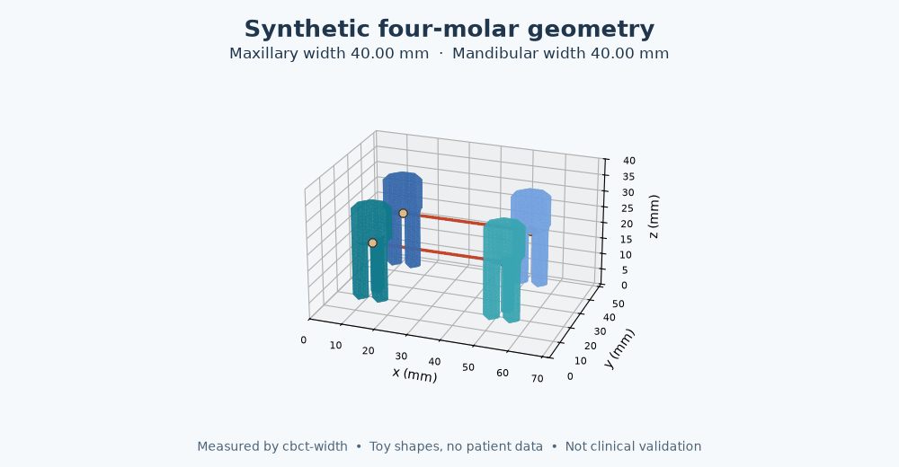
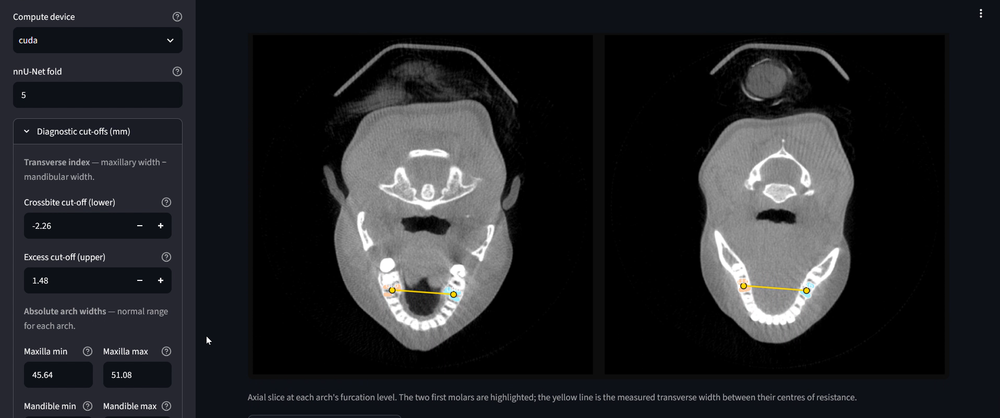

# 🦷 CBCT transverse basal-bone width

**Measure bilateral first-molar widths from 3D tooth segmentations, with landmarks and quality checks you can inspect.**

CBCT segmentation alone does not provide an auditable transverse measurement. This project connects a pretrained tooth model to physical-space geometry: localize each first molar's furcation, measure the maxillary and mandibular widths, and report their difference.

**Reported pilot result:** mean landmark error **1.63 mm**, maximum **2.30 mm**, across four landmarks on **one scan**. This is the previously reported example, not a cohort accuracy estimate or a new validation result. [Evidence and limitations](docs/model-card.md#evaluation-status).

[Getting started](#getting-started) · [Source](src/cbct_width) · [Algorithm](docs/algorithm.md) · [Gallery](docs/gallery.md) · [Model card](docs/model-card.md)



*Synthetic demonstration generated with the actual measurement code. The toy shapes contain no patient data and do not establish clinical accuracy.*

## What the project contributes

- **Physical-space geometry:** apply the NIfTI affine before PCA, then search for persistent root separation and the convex-hull webbing centroid.
- **Inspectable quality control:** retain root-count rules, confidence flags, furcation depth, and skeleton disagreement for each tooth.
- **Reusable computation:** use a Python package, CLI, or Streamlit; reuse compatible masks and resume recorded batch results.
- **Engineering checks:** synthetic tests, Linux/Windows CI, an immutable Docker base reference, and pinned CPU/UI/test dependencies.

The segmentation model is pretrained upstream. The geometric measurement, validation workflow, and application integration are the focus here. [Upstream sources and terms](docs/third-party.md).

## Getting started

Use **Python 3.12**. Clone the repository and create a virtual environment, then:

```bash
python -m pip install -c requirements-lock.txt -e ".[ui]"
cbct-width demo --output demo-output
cbct-width measure demo-output/synthetic_FULL_MASK.nii.gz --output demo-output/result.json
python -m streamlit run app.py
```

The synthetic demo and existing-mask measurement require neither GPU access nor model weights. The example phantom has **40 mm** between the translated paired teeth in each arch.

For a folder of original scans with matching saved masks:

```bash
cbct-width batch ./scans --output ./results --device cpu
```

Use a separate output directory. Missing or rejected masks require fresh segmentation, which needs the optional nnU-Net/PyTorch environment and separately downloaded weights. [Complete setup, model installation, Docker, and Colab](SETUP.md).

## Application preview



The screenshots are illustrative examples supplied with the project. [View all nine figures, including the 3D molar views](docs/gallery.md).

## Evidence and next steps

| Available now | Still needed |
| :--- | :--- |
| One previously reported scan with four reference landmarks | Independent cohort evaluation with clinician reference measurements |
| Synthetic geometry and failure-recovery tests | Scanner, voxel-size, metal-artifact, and field-of-view robustness studies |
| Implemented CCC, ICC(2,1), and Bland–Altman summaries | Cohort estimates with confidence intervals; classification sensitivity/specificity |
| Per-tooth quality flags | Quantified failure rates and error stratified by fallback rule |

The three-case minimum in the statistics code is a computational guard, **not** evidence of an adequate validation sample. Tests establish software behavior on toy data; they do not establish diagnostic performance. [Evaluation plan](docs/model-card.md#next-evaluation).

## Development

```bash
python -m pip install -c requirements-lock.txt -e ".[ui,dev]"
python -m pytest
python -m build
```

```text
src/cbct_width/   geometry, inference/I/O, validation, batch, CLI, and UI
tests/           synthetic phantoms and integration/failure tests
docs/            algorithm, gallery, model card, upstream terms, demo
app.py           small Streamlit entry point
pyproject.toml   package metadata and CLI command
Dockerfile       CPU measurement/UI image; no embedded data or weights
CBCT_Width_Analysis.ipynb   optional Colab frontend to the package
```

The package is the source of truth. The notebook imports it and no longer generates `app.py`. See [testing scope](docs/testing.md) for what is verified.

> **Research prototype — not a medical device.** Outputs require expert review and are not a substitute for clinical assessment. No regulatory compliance or clinical deployment readiness is claimed.

No project license has been selected. Upstream dependencies, weights, and datasets retain their own terms. [Details](docs/third-party.md).

**Basma Tarek** · [GitHub](https://github.com/Basma2753)
