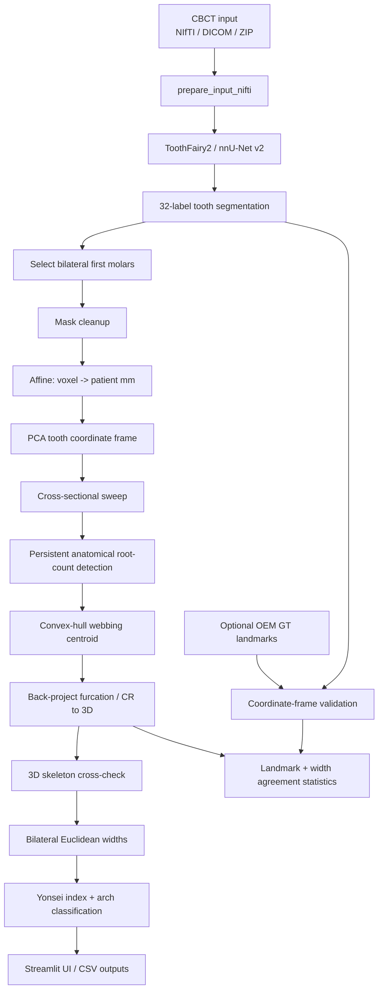

<div align="center">

# 🦷 CBCT Transverse Basal-Bone Width Analysis

### 3D medical-imaging pipeline for automatic tooth segmentation, first-molar furcation / center-of-resistance localization, and transverse skeletal measurements

[](https://www.python.org/)
[](https://pytorch.org/)
[](https://github.com/MIC-DKFZ/nnUNet)
[](https://streamlit.io/)
[](https://colab.research.google.com/)
[](#)

<br>


**Raw CBCT → ToothFairy2 segmentation → physical-space 3D geometry → first-molar CR points → bilateral widths → Yonsei transverse classification**

</div>

---

## Why this project

This project turns a CBCT research workflow into a complete, demonstrable **medical computer-vision system**. It combines a pretrained 3D segmentation network with deterministic geometric analysis, coordinate-system validation, cohort statistics, batch processing, and a Streamlit application.

The important engineering distinction is:

- **Deep learning** is used for **tooth segmentation** with the released ToothFairy2 / nnU-Net v2 model.
- **Center-of-resistance localization is not a neural-network prediction in the current version.** It is a custom deterministic 3D geometry pipeline operating on the segmented tooth mask and its NIfTI affine.
- The code currently uses the **semantic tooth-segmentation output**. It does **not** implement ToothSeg's separate instance-segmentation + semantic/instance self-correction branch.
- Ground-truth landmarks are **optional for inference** and are used only for validation/evaluation.

### At a glance

| | |
|---|---|
| **Input** | NIfTI, DICOM ZIP, DICOM slice set; batch mode also supports DICOM folders and Invivo `.inv` packages |
| **Segmentation** | nnU-Net v2 + `Dataset121_ToothFairy2_Teeth` |
| **Segmentation output** | Dense multi-label tooth mask, labels 1–32 |
| **Primary landmarks** | Furcation-based CR proxies of bilateral first permanent molars |
| **Geometry** | Affine transforms, PCA, connected components, convex hulls, 3D skeletonization |
| **Measurements** | Maxillary width, mandibular width, Yonsei Transverse Index |
| **Validation** | OEM landmarks, handedness checks, zero-parameter mapping, landmark error, CCC, ICC(2,1), Bland–Altman |
| **Interface** | Streamlit |
| **Execution** | Google Colab GPU / CUDA, with CPU fallback |
| **Batch outputs** | `batch_results.csv`, `batch_landmarks.csv`, `batch_cohort_stats.csv` |

### Navigate

[**Visual walkthrough**](#visual-walkthrough) ·
[**Architecture**](#end-to-end-architecture) ·
[**Code walkthrough**](#how-the-code-works) ·
[**Segmentation**](#stage-1--3d-tooth-segmentation) ·
[**CR algorithm**](#stage-2--furcation--center-of-resistance-localization) ·
[**Measurements**](#stage-3--bilateral-transverse-measurements) ·
[**Validation**](#ground-truth-validation) ·
[**Batch mode**](#batch-processing) ·
[**Function reference**](#code-map) ·
[**Run instructions**](#running-the-project)

---

## Visual walkthrough

### 1. Upload a CBCT and configure the analysis


The interface accepts `.nii`, `.nii.gz`, DICOM ZIPs, or multiple `.dcm` slices. The sidebar exposes the compute device, nnU-Net fold, diagnostic cut-offs, absolute arch-width ranges, and first-molar label mapping.

### 2. Run the pipeline and obtain quantitative results


The results page reports bilateral arch widths, per-arch deficiency/normal/excess status, the Yonsei Transverse Index, and the final transverse skeletal relationship.

### 3. Trace the measurement back to the anatomy


The displayed axial slices are taken near each arch's estimated furcation level. First-molar CR points are overlaid and connected by the line used for the bilateral width.

---

## End-to-end architecture



### Inference path

```text
Raw CBCT
   │
   ▼
Input preparation
   │
   ▼
nnU-Net / ToothFairy2
   │
   ▼
Full multi-label tooth mask
   │
   ├── maxillary first molars: expected 3 roots
   └── mandibular first molars: expected 2 roots
            │
            ▼
   physical-space PCA frame
            │
            ▼
   topology-aware furcation search
            │
            ▼
   CR/furcation points in patient mm
            │
            ▼
   bilateral arch widths
            │
            ▼
   Yonsei Transverse Index
```

---

# How the code works

## 1. Colab notebook orchestration

The notebook is intentionally designed as a **single-file launcher** rather than a collection of fragile local modules.

### Dependency cell

It installs:

```text
PyTorch / torchvision / torchaudio — CUDA 12.4 build
nnunetv2
streamlit
nibabel
matplotlib
SimpleITK
pydicom
numpy==2.0.2
scipy==1.14.1
scikit-image==0.24.0
```

The NumPy/SciPy/scikit-image stack is force-reinstalled at pinned versions. A sanity check detects the common Colab failure mode where a scientific package is replaced on disk while an incompatible older version remains loaded in memory; in that situation the notebook explicitly asks for a runtime restart instead of continuing with a corrupted environment.

### Google Drive cell

The Drive cell:

1. mounts `/content/drive`;
2. checks the configured scans directory;
3. reports what file types are present;
4. makes the same mounted files available to the batch engine.

### `%%writefile app.py`

The largest notebook cell writes a **self-contained `app.py`** containing:

- segmentation orchestration;
- CR/furcation geometry;
- DICOM/NIfTI input handling;
- validation;
- cohort statistics;
- batch processing;
- the complete Streamlit UI.

This keeps deployment simple:

```bash
streamlit run app.py
```

### Model setup cell

The released ToothFairy2 model is downloaded once and installed into nnU-Net's expected `nnUNet_results` directory. On future runs, the code detects the existing model and skips the download.

### Direct batch mode

The notebook can run the exact same batch engine **without opening Streamlit**. It reads the pure pipeline portion of `app.py` before `st.set_page_config`, executes those definitions, and calls `_run_batch`. This avoids maintaining two separate implementations of the same pipeline.

---

# Stage 1 — 3D tooth segmentation

## Model

The segmentation stage uses:

```text
Dataset121_ToothFairy2_Teeth
```

through **nnU-Net v2**.

The segmentation model produces a dense label volume with individual tooth labels. The code then identifies the four first permanent molars used by the transverse analysis.

### First-molar mapping in the inference pipeline

After the code's DICOM/NIfTI handedness correction, the default ToothFairy2 first-molar labels are:

| Tooth | Default segmentation label | Expected roots |
|---|---:|---:|
| UR6 | 14 | 3 |
| UL6 | 6 | 3 |
| LR6 | 22 | 2 |
| LL6 | 30 | 2 |

The Streamlit sidebar allows these numeric labels to be overridden. Optional ground-truth validation also tests the configured and mirrored left/right assignments and can identify a scan that arrived through a different conversion chain.

> Bilateral widths are invariant to swapping left and right, but the correct tooth naming still matters for validation and per-tooth reporting.

## Input staging

nnU-Net expects the single CBCT channel to be named:

```text
{case_id}_0000.nii.gz
```

`_stage_input()` converts/copies the uploaded NIfTI into this convention.

## Restoring the full mask

After inference, `_restore_segmentation_to_input_grid()` ensures that the final segmentation has the **original CBCT shape and affine**. Label maps are resampled with nearest-neighbour interpolation so integer tooth classes are not blurred into invalid intermediate values.

---

# Stage 2 — Furcation / center-of-resistance localization

The downstream CR code uses the **segmentation mask + affine**. Once segmentation is complete, the CBCT intensity volume is not required by the CR estimator itself.

## Step 1 — Clean the tooth mask

`_clean_tooth_mask()`:

- fills internal holes;
- removes tiny disconnected components;
- protects PCA and connected-component analysis from segmentation speckles.

A tooth with fewer than 200 cleaned foreground voxels is treated as too small/unreliable for furcation localization.

## Step 2 — Convert voxels to physical millimetres

Every foreground voxel coordinate is transformed with the NIfTI affine:

```python
patient_xyz = nib.affines.apply_affine(affine, voxel_ijk)
```

Conceptually:

\[
\mathbf p_{mm} = A
\begin{bmatrix}
i\\j\\k\\1
\end{bmatrix}
\]

This is essential because CBCT volumes may have anisotropic spacing, nontrivial orientation, or oblique affines. Geometry performed directly in voxel indices would not represent true physical distance.

## Step 3 — PCA in physical space


The code centers the 3D tooth point cloud, computes its covariance matrix, obtains its eigenvectors/eigenvalues, and orders the axes from highest to lowest variance.

```text
v1 = dominant PCA direction
v2 = orthogonal cross-sectional direction
v3 = orthogonal cross-sectional direction
```

The eigenvector sign is made deterministic so the same tooth does not arbitrarily flip axes between runs.

### Why the code does not blindly call `v1` the anatomical long axis

Molars are not simple elongated cylinders: a broad crown and splayed roots can change the direction of maximum variance. The code therefore uses the PCA frame as a **candidate geometric coordinate system** and resolves crown/root polarity from cross-sectional anatomy instead of trusting an arbitrary eigenvector sign.

## Step 4 — Adaptive cross-sectional sampling

The tooth is projected into PCA coordinates:

```text
t  = coordinate along the candidate long axis
s2 = coordinate along v2
s3 = coordinate along v3
```

The nominal sweep step is **0.4 mm**, but the implementation raises it when necessary:

```text
effective_step =
max(0.4 mm, 1.25 × projected voxel sampling along v1)
```

This prevents false empty slices and artificial disconnections in anisotropic scans.

The 2D raster grid uses approximately:

```text
0.75 × smallest voxel spacing
```

with a 0.05 mm lower safety floor.

Each 3D voxel is stamped into the 2D cross-section with a physical footprint based on voxel dimensions. That keeps a real root internally connected without requiring aggressive dilation that could merge neighboring roots.

## Step 5 — Connected-component root counting


At every sweep level, the code counts physically meaningful connected components.

Default topology parameters:

| Parameter | Current default | Purpose |
|---|---:|---|
| nominal long-axis step | 0.4 mm | localize the transition along the tooth |
| persistence | 4 consecutive slices | reject one-slice noise |
| minimum component area | 0.5 mm² | discard tiny fragments |
| maxillary expected roots | 3 | anatomical trifurcation |
| mandibular expected roots | 2 | anatomical bifurcation |
| root-count rule | `exact` first | require the anatomical count before relaxing |

For a maxillary first molar, the intended transition is not merely `>=2` components. The algorithm waits for **three persistent components**, because stopping at an earlier two-component stage can represent one separated root plus a still-connected two-root mass.

## Step 6 — Crown guard

The occlusal cusps themselves can appear as multiple disconnected components. To avoid mistaking cusps for roots, the search does **not** begin at the tooth tip.

The code finds the largest cross-sectional area—used as the crown's height-of-contour region—and only starts the crown→root furcation search from there.

## Step 7 — Root-count fallback ladder

The search tries increasingly permissive rules:

```text
exact:N
   ↓ if unavailable
at_least:N
   ↓ for 3-root teeth if still unavailable
relaxed:>=2
```

The exact rule is preferred. A fallback result is not silently treated as equivalent; `rule_used` is saved and a relaxed result lowers confidence.

## Step 8 — Furcation webbing centroid


At the selected root-separation plane:

1. build the foreground root cross-section;
2. compute its **exact convex hull**;
3. subtract the foreground root components;
4. take the centroid of the remaining interior “webbing” region;
5. convert that 2D centroid back into the PCA coordinate frame;
6. back-project it to 3D patient coordinates.

The convex hull replaced a fixed morphological closing strategy because a diamond-shaped structuring element can behave differently as the tooth rotates inside the PCA cross-section.

The diagnostic image above exposes the actual internal reasoning: component counts at consecutive levels, the chosen furcation slab, convex-hull webbing, centroid, back-projection, root count, rule used, furcation depth, and confidence information.

## Step 9 — 3D skeleton cross-check

The code separately skeletonizes the 3D tooth mask.

A skeleton voxel with at least three neighbors in its local `3×3×3` neighborhood is treated as a branch point. Only branch points on or near the **root side** of the primary furcation are considered, preventing crown/cusp junctions from becoming the sanity-check target.


### Confidence logic

`estimate_tooth_cr()` uses a 2 mm default disagreement threshold:

| Result | Meaning |
|---|---|
| **high** | strict anatomical root-count rule fired **and** a root-side skeleton branch agrees within 2 mm |
| **medium** | strict rule fired, but no usable root-side skeleton branch was available |
| **low** | relaxed root-count rule was needed, or a skeleton branch exists but disagrees by more than 2 mm |

The skeleton is a **cross-check**, not the primary CR estimator.

---

# Stage 3 — Bilateral transverse measurements

For each arch:

\[
W = \left\| \mathbf{CR}_R - \mathbf{CR}_L \right\|_2
\]

```text
Maxillary width = distance(UR6_CR, UL6_CR)
Mandibular width = distance(LR6_CR, LL6_CR)
```


The example above shows a maxillary bilateral CR distance of **39.56 mm**.

---

# Stage 4 — Yonsei transverse classification

The code calculates:

\[
TI = W_{maxilla} - W_{mandible}
\]

Default configurable cut-offs in the current code:

```text
TI < -2.26 mm  -> skeletal crossbite / maxillary transverse deficiency
-2.26 to 1.48 -> normal transverse skeletal relationship
TI > 1.48 mm   -> transverse excess pattern
```

The code also evaluates each arch independently:

| Arch | Deficiency | Normal | Excess |
|---|---:|---:|---:|
| Maxilla | `< 45.64 mm` | `45.64–51.08 mm` | `> 51.08 mm` |
| Mandible | `< 46.30 mm` | `46.30–51.20 mm` | `> 51.20 mm` |

This distinction matters because a normal maxilla-minus-mandible index can still occur when **both arches are narrow**.

The thresholds are exposed in the Streamlit sidebar and are therefore study-configurable.

---

# Input handling in detail

## NIfTI

`.nii` and `.nii.gz` are accepted directly.

## DICOM

For DICOM input, the code:

1. recursively scans the supplied folder;
2. removes macOS metadata files;
3. detects available series;
4. selects the series with the most slices for ordinary DICOM uploads;
5. converts it to NIfTI using SimpleITK;
6. preserves spacing and orientation metadata.

For the upload UI, users can provide either:

```text
a ZIP containing the DICOM series
```

or:

```text
many .dcm slices selected together
```

## Invivo `.inv` packages in batch mode

Batch discovery supports Invivo project **packages/folders**.

The code prefers the largest DICOM **byte payload** inside the package, because a scout/TMJ study can contain many tiny slices while the actual CBCT is the larger payload.

If no usable DICOM series is present, `_config_inv_to_nifti()` attempts a best-effort native-volume fallback. It requires discoverable dimensions and voxel spacing; those values are not guessed.

---

# Ground-truth validation

Ground truth is **not required to run the pipeline**.

When OEM landmark CSV files are available, the validation layer is designed to avoid confusing a coordinate-system mismatch with localization error.

## Zero-parameter path

For landmarks created on the same image grid:

```text
OEM Image CS
    ↓
divide by voxel spacing
    ↓
voxel coordinates
    ↓
scan affine
    ↓
scan/world mm
```

For OEM Patient CS, the code first re-centers using an offset derived from the scan dimensions and spacing, then performs the same mapping.

No rotation/translation is fitted to the prediction before scoring in this primary path.

## Landmark landing check

A furcation landmark lies in the notch between roots, so an exact requirement that the point sit *inside* foreground tooth voxels can be too brittle.

The code therefore measures distance to the expected tooth label and uses an **8-voxel default landing tolerance** for frame/handedness arbitration.

It evaluates both:

```text
configured left/right mapping
mirrored left/right mapping
```

and chooses the mapping whose landmarks correctly land near their own teeth.

## Frame-recovery fallback

When direct zero-parameter mapping cannot be verified, the fallback searches all **48 signed axis permutations** and anchors the candidate frame to segmented teeth—not to the predicted CR points.

That design is important: predicted landmarks are not used to fit away the error that will later be measured.

## Validation outputs

Per landmark:

```text
pred_x, pred_y, pred_z
gt_x, gt_y, gt_z
dx, dy, dz
Euclidean error (mm)
landing distance
confidence
root-count rule
```

Per case / cohort:

- mean, maximum, and RMS CR localization error;
- predicted vs GT bilateral widths;
- Lin's CCC;
- ICC(2,1);
- Bland–Altman bias;
- Bland–Altman limits of agreement.

---

# Batch processing

Batch mode can discover:

```text
.nii / .nii.gz
DICOM ZIP
DICOM folder
Invivo .inv package/folder
```

and automatically associate nearby OEM landmark CSVs when they can be matched safely to a case.

### Crash-safe design

`_run_batch()` rewrites output CSVs **after every case**.

That means:

- a Colab disconnect does not erase already recorded results;
- restarting the same job can skip completed cases;
- failed cases can be retried;
- the cohort files progressively become usable during long runs.

### CSV outputs

#### `batch_results.csv`

One row per case, including:

- status;
- maxillary / mandibular widths;
- transverse index;
- diagnosis;
- arch sub-classification;
- per-tooth quality flags;
- optional GT width columns;
- validated landmark error summaries.

#### `batch_landmarks.csv`

One row per case × molar:

- predicted CR coordinates;
- mapped GT coordinates when verified;
- Euclidean error;
- landing distance;
- root counts;
- rule used;
- confidence.

#### `batch_cohort_stats.csv`

For cohorts with enough validated cases:

- CCC;
- ICC(2,1);
- bias;
- SD of differences;
- Bland–Altman limits of agreement.

---

# Streamlit application

The UI exposes the research pipeline without requiring the user to modify code.

### Sidebar

- compute device: `cuda` / `cpu`;
- nnU-Net fold;
- lower and upper transverse-index cut-offs;
- absolute maxillary and mandibular normal ranges;
- editable first-molar label mapping;
- model status and model-download action.

### Single-scan workflow

```text
Upload
  ↓
Prepare NIfTI
  ↓
Segment
  ↓
Restore labels to original grid
  ↓
Locate CRs
  ↓
Measure widths
  ↓
Classify
  ↓
Visualize / export
```

### Visual outputs

The application includes:

- axial CBCT measurement views;
- first-molar overlays;
- CR markers;
- bilateral measurement lines;
- per-tooth root-count and confidence information;
- interactive 3D molar geometry;
- furcation-debug visualization;
- optional ground-truth comparison;
- downloadable CSV data.

---

# Code map

The repository's core logic is intentionally transparent. The table below maps the major code paths to their responsibilities.

<details>
<summary><strong>Open the complete function-by-function reference</strong></summary>

<br>

#### Data structures

| Symbol | What it does |
|---|---|
| `ToothCR` | Dataclass holding one tooth’s CR/furcation point, long axis, centroid, skeleton cross-check, disagreement, voxel count, root-count metadata, rule used, furcation depth, and confidence. |
| `CaseResult` | Dataclass holding one case ID, all per-tooth results, and per-arch transverse widths. |

#### 3D geometry and CR localization

| Symbol | What it does |
|---|---|
| `_apply_affine` | Transforms voxel indices `(i,j,k)` into patient/world coordinates in millimetres using the NIfTI affine. |
| `_principal_axes` | Computes deterministic PCA axes from the tooth point cloud in physical space; eigenvectors are ordered by decreasing eigenvalue. |
| `_clean_tooth_mask` | Fills interior holes and removes tiny disconnected speckles before geometry analysis. |
| `_cross_section_component_count` | Rasterizes a PCA-aligned tooth slab in 2D, stamps each voxel with a physical footprint, removes sub-threshold components, and returns the connected-root count. |
| `_convex_hull_2d` | Computes the exact 2D convex hull of a cross-section; used to make the furcation webbing estimate rotation-independent. |
| `_find_furcation_3d` | Core CR algorithm: PCA frame → adaptive axial sweep → crown guard → persistent root-count search → convex-hull webbing centroid → 3D back-projection. |
| `_skeleton_branch_points_mm` | Skeletonizes the 3D tooth mask and returns branch/junction points in millimetres for an independent sanity check. |
| `estimate_tooth_cr` | Combines the primary furcation estimate with the root-side skeleton check and assigns high/medium/low confidence. |
| `_coerce_arch` | Validates arch specifications and requires an explicit anatomical root count. |
| `process_case` | Loads a multi-label tooth segmentation, estimates CRs for both first molars in each arch, then computes bilateral widths. |

#### Classification

| Symbol | What it does |
|---|---|
| `classify_transverse` | Computes `maxilla − mandible` and classifies the Yonsei transverse relationship using configurable lower/upper cut-offs. |
| `classify_arch_width` | Classifies each arch independently as deficient, normal, or excessive using configurable absolute-width ranges. |
| `_noop` | No-op callback used where an optional logger/progress function is not supplied. |

#### Model setup and segmentation

| Symbol | What it does |
|---|---|
| `get_results_dir` | Returns the nnU-Net results directory, honoring the `nnUNet_results` environment variable. |
| `model_is_ready` | Checks whether the ToothFairy2 model directory exists and is populated. |
| `detect_model_config` | Reads the shipped nnU-Net trainer/plans/configuration from the model folder name instead of hard-coding it. |
| `setup_model` | Downloads and installs the public ToothFairy2 release when needed; idempotent on repeated runs. |
| `_stage_input` | Copies/converts a NIfTI scan into nnU-Net’s `{case_id}_0000.nii.gz` single-channel naming convention. |
| `_restore_segmentation_to_input_grid` | Restores the predicted label map to the uploaded scan’s original shape and affine using nearest-neighbour interpolation. |
| `segment_scan` | Runs nnU-Net inference for one CBCT scan using the selected fold/device and returns the full tooth-label segmentation. |
| `measure_widths` | Runs the deterministic molar/CR geometry analysis on a segmentation. |
| `run_pipeline` | Single-scan orchestration: segmentation first, then width measurement. |

#### Input handling and visualization

| Symbol | What it does |
|---|---|
| `_strip_macos_junk` | Removes `.DS_Store` and AppleDouble `._*` files that can interfere with DICOM discovery. |
| `dicom_folder_to_nifti` | Recursively discovers DICOM series, chooses the series with the most slices, and converts it to NIfTI while preserving spacing/orientation. |
| `_case_id_from_name` | Normalizes an uploaded filename into a stable case identifier. |
| `prepare_input_nifti` | Accepts NIfTI, DICOM ZIP, or multiple DICOM slices and produces one NIfTI volume plus a case ID. |
| `render_measurement_figure` | Creates axial CBCT visualizations at the furcation level with CR points and the measured bilateral line; failures do not invalidate numeric results. |

#### Ground-truth / coordinate validation

| Symbol | What it does |
|---|---|
| `_parse_oem_landmarks` | Parses OEM landmark CSV exports and returns the named 3D points plus coordinate-system information. |
| `_oem_name_to_label` | Maps OEM tooth/landmark names to the active segmentation labels. |
| `_label_to_tooth` | Builds the reverse label-to-tooth-name mapping. |
| `_gt_landing_count` | Counts how many mapped GT landmarks fall exactly on their expected tooth labels. |
| `_gt_landing_distances` | Measures each mapped landmark’s voxel distance to its own tooth mask; the default acceptance tolerance is 8 voxels. |
| `_swap_lr_labels` | Mirrors left/right tooth names while keeping numeric labels unchanged, allowing per-case handedness arbitration. |
| `_gt_zero_param_map` | Maps OEM Image CS / Patient CS points to scan world coordinates without fitting parameters to the landmarks being scored. |
| `_pairwise_shape_report` | Compares all pairwise landmark distances; because pairwise distances are rigid-frame invariant, this separates shape/localization disagreement from coordinate-frame differences. |
| `_fit_rigid_transform` | Kabsch-style similarity fit used to characterize coordinate-system relationships, not to erase prediction error before scoring. |
| `_signed_permutation_mats` | Generates all 48 axis permutations/sign flips used to test software coordinate conventions. |
| `_describe_axis_map` | Turns an axis-permutation/sign matrix into a readable description. |
| `_tooth_cr_proxy` | Creates a prediction-free tooth anchor near the furcation level for fallback frame recovery. |
| `_recovery_tolerance` | Derives a case-specific tolerance from residual rotation, scale, landmark radius, and anchor residuals. |
| `_lin_ccc` | Computes Lin’s concordance correlation coefficient. |
| `_icc_2_1` | Computes ICC(2,1): two-way random, absolute agreement, single measurement. |
| `_recover_frame_via_teeth` | Recovers a GT→scan coordinate convention using segmented teeth as anchors, explicitly without using predicted CRs. |
| `_reconcile_frame` | Classifies the relationship between coordinate frames as identity, translation, transform-needed, or insufficient. |
| `_bilateral_width` | Computes a left/right landmark distance when both points are available. |

#### Batch / Invivo support

| Symbol | What it does |
|---|---|
| `_best_dcm_series_dir` | Inside an Invivo package, selects the DICOM series with the largest byte payload rather than blindly choosing the highest slice count. |
| `_find_config_inv` | Finds the native `*Config*.inv` volume, or otherwise the largest `.inv` file. |
| `_config_inv_to_nifti` | Best-effort fallback reader for native Invivo volume payloads when no usable DICOM series exists; dimensions/spacing must be present and are not guessed. |
| `_discover_batch_cases` | Recursively discovers NIfTI, DICOM ZIPs, DICOM folders, and Invivo packages; also associates nearby landmark CSVs. |
| `_prepare_input_from_path` | Batch-mode counterpart of `prepare_input_nifti`. |
| `_zero_param_validate` | Headless batch validation: zero-parameter GT mapping, handedness test, per-landmark errors, and GT widths. |
| `_run_batch` | Processes the cohort, writes CSVs after every case for crash-safe resume, and computes cohort agreement statistics when enough GT cases exist. |

</details>

---

# Notebook cell map

| Notebook section | Responsibility |
|---|---|
| **1 — Install dependencies** | GPU PyTorch, nnU-Net, Streamlit, medical-image I/O, pinned numeric stack, import sanity checks |
| **1b — Mount Google Drive** | Drive access and batch-folder inspection |
| **2 — Write the app** | Generates the complete self-contained `app.py` |
| **3 — Download model** | One-time ToothFairy2 model setup |
| **Troubleshooting** | Streamlit/tunnel/browser and numerical-environment recovery guidance |
| **Direct batch run** | Loads the pipeline from `app.py` and runs the cohort without the web UI |

---

# Technology stack

| Area | Technology |
|---|---|
| Language | Python |
| Deep learning | PyTorch |
| Segmentation | nnU-Net v2 / ToothFairy2 |
| Medical image formats | DICOM, NIfTI |
| I/O / geometry | NiBabel, SimpleITK, pydicom |
| Numerical computing | NumPy, SciPy |
| Morphology / topology | scikit-image |
| Data analysis | pandas |
| Visualization | Matplotlib + interactive Streamlit/Plotly-style 3D view in the app |
| UI | Streamlit |
| GPU runtime | Google Colab / CUDA |
| Validation | Euclidean landmark error, CCC, ICC(2,1), Bland–Altman |

---

# Running the project

## Google Colab

1. Open the notebook in Colab.
2. Select a GPU runtime; the project was designed to run with CUDA and was tested in an A100-style Colab workflow.
3. Run the dependency cell.
4. Restart the runtime if the dependency sanity check requests it.
5. Mount Google Drive if scans are stored there.
6. Run the `app.py` generation cell.
7. Download/detect the ToothFairy2 model.
8. Launch Streamlit and open the generated tunnel/proxy URL.
9. Upload one scan and click **Run analysis**.

## Local Streamlit

After preparing the model and dependencies:

```bash
streamlit run app.py
```

---

# Recommended repository structure

```text
CBCT-Transverse-Width/
│
├── README.md
├── app.py
├── CBCT_Width_Colab.ipynb
├── requirements.txt
│
├── docs/
│   ├── demo.mp4                 # optional: add your screen recording
│   └── images/
│       ├── interface-upload.png
│       ├── interface-results.png
│       ├── interface-measurement.png
│       ├── interface-3d-molar-cr.png
│       ├── furcation-localization-diagnostics.png
│       ├── transverse-width-cr-points.png
│       ├── pca-tooth-long-axis.svg
│       └── pca-furcation-sweep.svg
│
├── examples/
│   └── README.md
│
└── results/
    └── README.md
```

> Do not commit patient CBCT volumes, DICOM identifiers, identifiable landmark files, or other protected clinical data to a public repository.

---

# What this project demonstrates

From an AI/ML engineering perspective, the project demonstrates more than model inference:

- integration of a pretrained 3D medical segmentation model;
- DICOM/NIfTI preprocessing;
- GPU inference;
- physical-coordinate reasoning;
- PCA and eigensystem analysis;
- 2D/3D topology and morphology;
- robust anatomical heuristics;
- coordinate-system validation;
- quantitative error analysis;
- cohort agreement statistics;
- resilient batch processing;
- interactive application development;
- explainable diagnostic visualizations.

The workflow moves from:

```text
raw clinical imaging
      ↓
deep-learning segmentation
      ↓
3D geometric reasoning
      ↓
anatomical landmarks
      ↓
quantitative measurements
      ↓
validation + usable interface
```

---

# Limitations and future work

The current pipeline is a **research implementation**, not a certified medical device.

Important current limitations:

- segmentation quality directly affects downstream geometry;
- fused or incompletely separated roots may trigger a relaxed rule and lower confidence;
- the skeleton check can be silent or unstable on thin/noisy structures;
- validation depends on correctly understood coordinate systems and reliable reference annotations;
- current CR localization is deterministic geometry, not a learned landmark detector.

Natural extensions include:

- a learned 3D CR landmark detector trained from expert GT points;
- comparison of **CBCT only vs mask only vs CBCT + mask** for CR localization;
- semantic + instance segmentation fusion/self-correction as an optional robustness stage;
- uncertainty estimation;
- external validation across scanners/sites;
- automated quality-control flags for segmentation failures.

---

# Research context

The code comments frame the furcation center as the CR proxy under the Yonsei transverse-analysis convention and cite supporting orthodontic/biomechanical literature. The implementation's main engineering focus is to make that convention reproducible in 3D physical space and to expose the assumptions and quality checks instead of returning an unexplained number.

---

# Portfolio summary

**CBCT Transverse Basal-Bone Width Analysis** is an end-to-end 3D medical-imaging project that combines **nnU-Net inference, medical-image preprocessing, physical-space PCA, topology-aware landmark localization, statistical validation, batch automation, and Streamlit deployment**.

It is particularly relevant to roles in:

- Machine Learning Engineering
- Computer Vision
- Medical Imaging AI
- 3D Vision
- Applied Deep Learning
- AI Systems / ML Deployment

---

## Disclaimer

This repository is intended for **research and engineering use**. It is not a certified medical device and should not replace professional clinical assessment.
